# C++ Study
- C++ 언어 기초와 고급 ( Ex1_1 ~ Ex15_1,
Tower_of_Hanoi, DynamicList, Chuseok_class, stl_ex1, Ctnr_stdt, CodingTest2 )

- TinyXML을 이용한 XML Parser ( XMLParser )

- RapidJSON을 이용한 Json Parser ( Character_Set )

- Windows 프로그래밍 ( SimpleWindow )

- 카드 짝 맞추기 게임 ( Solitaire, RandomFunc )
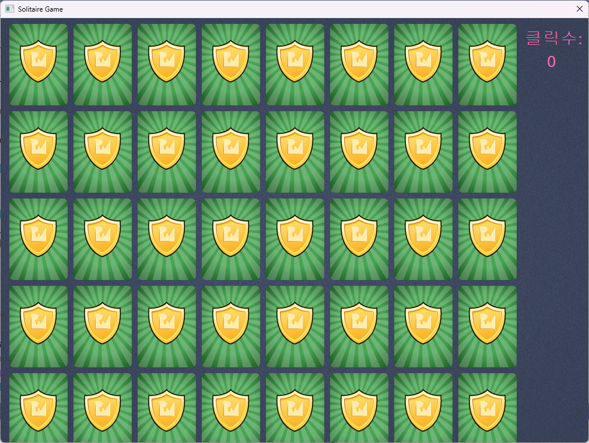
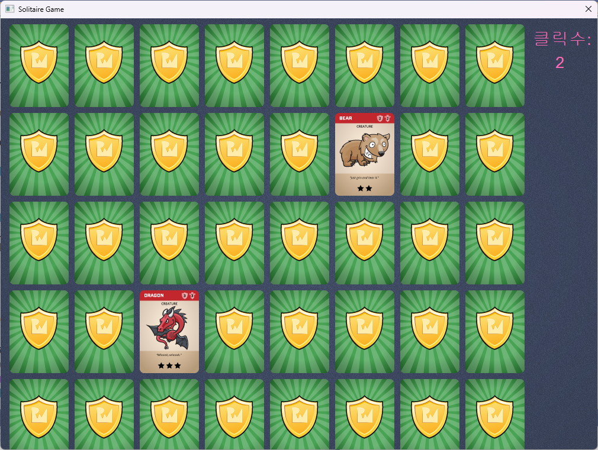
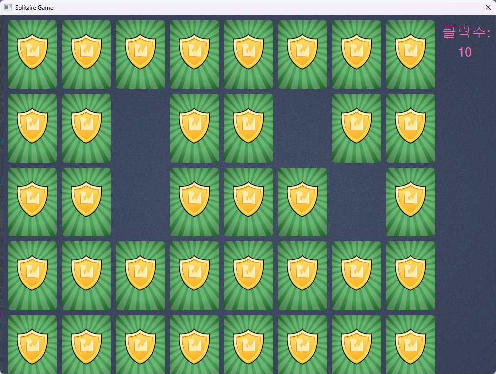

- Direct2D 프레임워크 ( Direct2D_1 )

- 가상 그래픽 카드 ( BITMAP )

- WIC를 이용한 이미지 그리기 ( ImageEx1 )
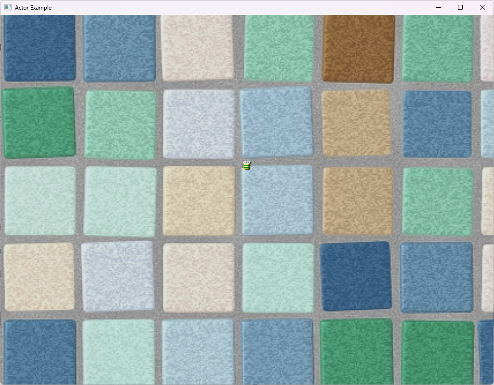

- 클릭으로 벌레 잡기 2D 게임 ( BuggHouse )
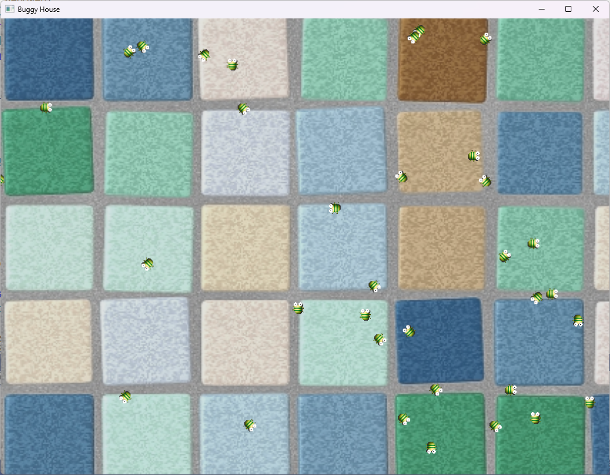
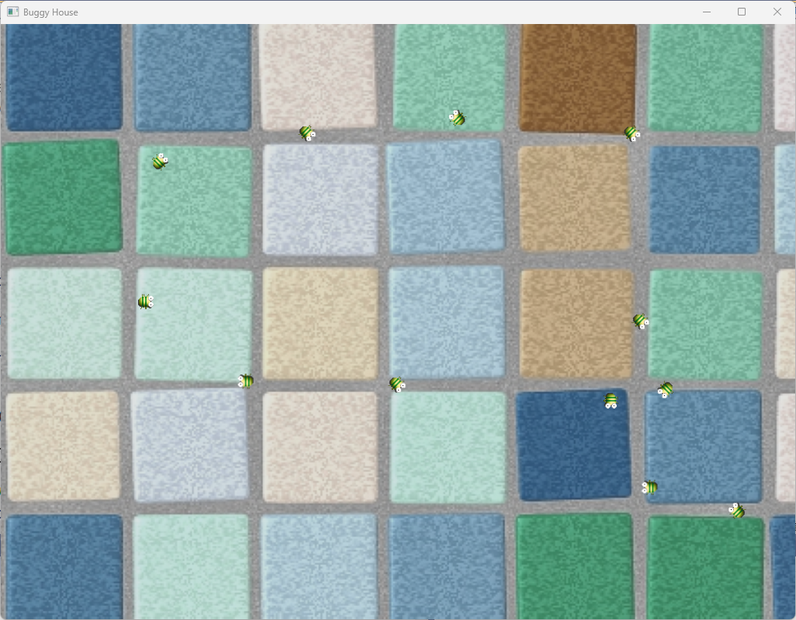

- Direct3D 프레임워크 ( Direct3DExample )
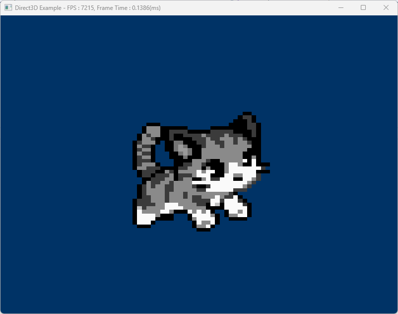

- DirectXTK을 이용한 Direct3D 프레임워크 ( DirectXTK )
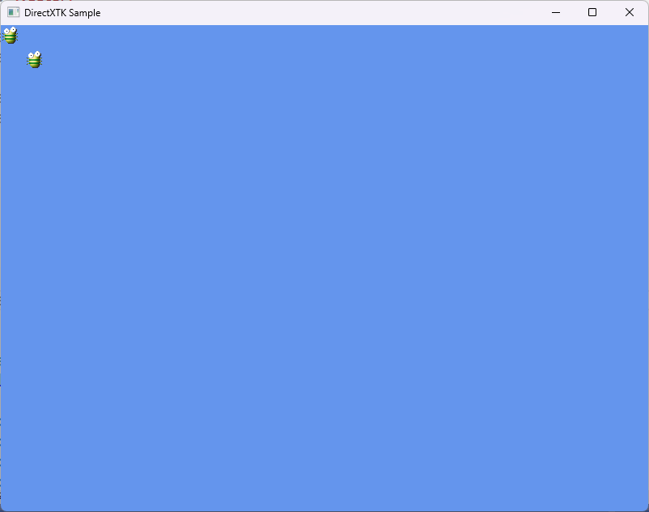
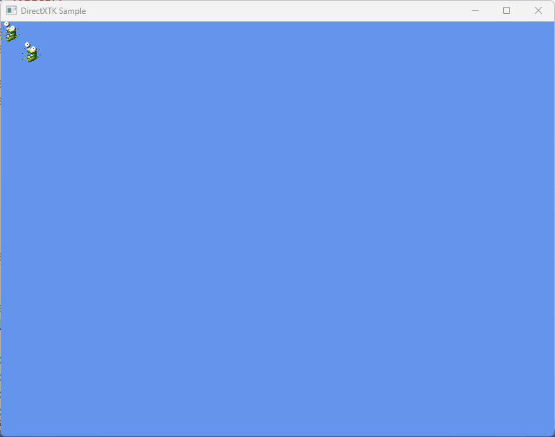
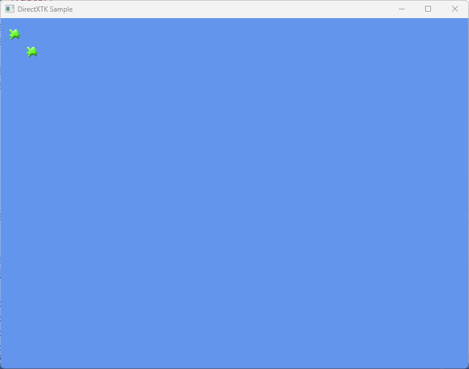
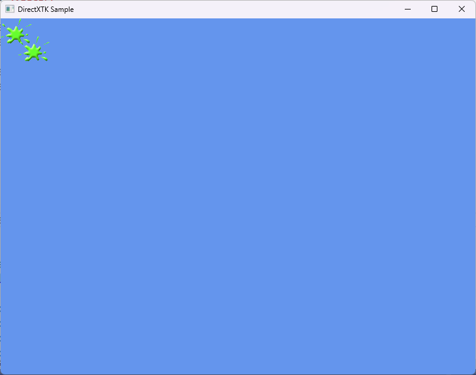

